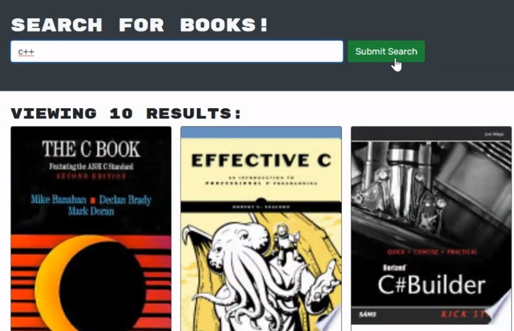

# Book Search Engine.

This app converts a fully functioning Google Books API search engine built with a RESTful API into a GraphQL API built with Apollo Server. Uses the MERN stack, with a React front end, MongoDB database, and Node.js/Express.js server and API.

## Deployment:

[Book search app](https://warm-beach-66290.herokuapp.com/)

## Demo:




## Built with:

- Mongo db

- Express

- React

- Node.js

## Installation:

```
$ git clone git@github.com:EPW80/MERN-Book-Search.git
$ cd book-search-engine
$ npm install
$ npm start
```

## contributor

Erik Williams
